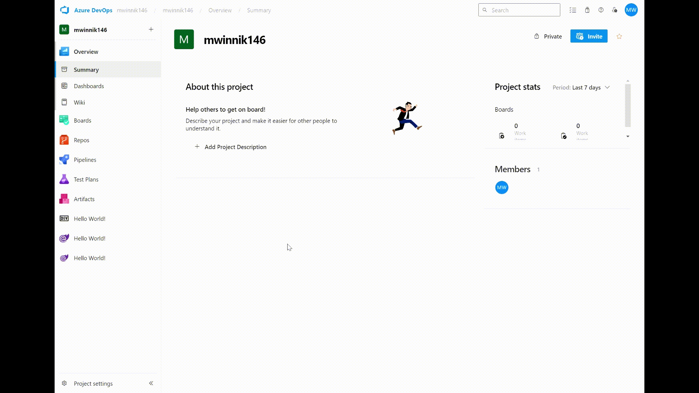

# Azure Devops Blazor Extension

Developing Azure DevOps extensions can be challenging. The documentation provided is not always extensive, and the examples may not always be up to date (for instance, I needed to make some adjustments to the Azure DevOps Extension SDK to make it compatible with my application). This project aims to address this gap by creating a straightforward Azure DevOps extension using Blazor WebAssembly. This has been a long-awaited request from developers who prefer using C# and Blazor over the suggested React and TypeScript.

The project is built upon the fundamental Blazor template, making it easy for developers to get started. Additionally, the application supports hot reload to streamline development and debugging processes. The application also includes a script that simplifies extension creation.

All the necessary instructions for building the application, along with supplementary resources, are provided within the README for your convenience.


## Demo 🎥


## Prerequisites 📝
- [.NET](https://dotnet.microsoft.com/en-us/)
- [tfs-cli](https://github.com/Microsoft/tfs-cli)
- [Powershell (optional)](https://learn.microsoft.com/en-us/powershell/scripting/install/installing-powershell?view=powershell-7.3)

## Get started 🚀
To begin with, you need to clone the repository on your local machine. To do so, run the following command in your terminal:
```
git clone https://github.com/MaciekWin3/azure-devops-blazor-extension
```

Next, you need to install all dependencies. To do so, run the following commands in your terminal:
```
cd src/AzDevOpsBlazorExtension/
npm install
```

## Development & Debugging 🛠🐞
This project is based on the basic Blazor template to simplify entry into the project. You can develop and debug it like a regular Blazor application. If you want to test it already uploaded to Azure DevOps, also benefiting from hot reload, you should first build the development version of the project and upload it to your Azure DevOps instance (for more info on that look at build section).

After that, the extension will listen on the port specified in the manifest (by default 7251). To  run your project and connect to your Azure Devops, use this command:
```
dotnet watch run --pathbase=/dist
```

This command will run your application in watch mode, automatically reloading it when you make changes to the code. Changing the 'pathbase' will enable access to the application from the Azure DevOps instance (the application expects all endpoints to be after '/dist')

## Build 🏗
Finally, you can build the extension. To do so you can run build.ps1 script located in root folder of this project:
```
./build.ps1
```

Script will build project in release mode and create .vsix file from dist folder (where builded project is located).

If you want to build project for development purposes, you can run build.ps1 script with --dev flag:
```
./build.ps1 --dev
```

## Usefull resources 📚
For more information about Azure DevOps extensions, see:
- [Develop a web extension](https://learn.microsoft.com/en-us/azure/devops/extend/get-started/node?view=azure-devops)
- [Azure DevOps Extension Hot Reload and Debug](https://github.com/microsoft/azure-devops-extension-hot-reload-and-debug)
- [Extension manifest reference](https://learn.microsoft.com/en-us/azure/devops/extend/develop/manifest?view=azure-devops)
- [Extension samples](https://learn.microsoft.com/en-us/azure/devops/extend/develop/samples-overview?view=azure-devops&source=recommendations)
- [azure-devops-extension-sdk](https://github.com/microsoft/azure-devops-extension-sdk)
- [azure-devops-extension-sample](https://github.com/microsoft/azure-devops-extension-sample)
- [tfs-cli](https://github.com/Microsoft/tfs-cli)


## Contriburtion 🤝

This project welcomes contributions and suggestions.


